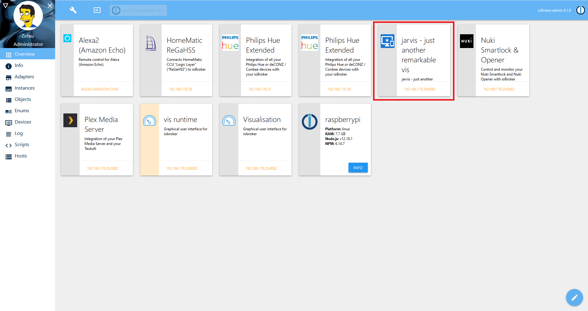
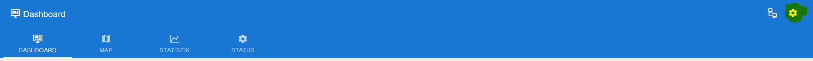
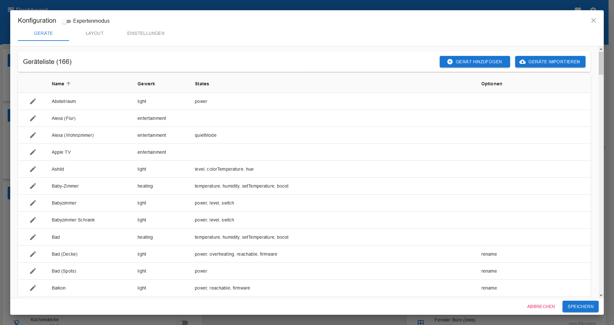
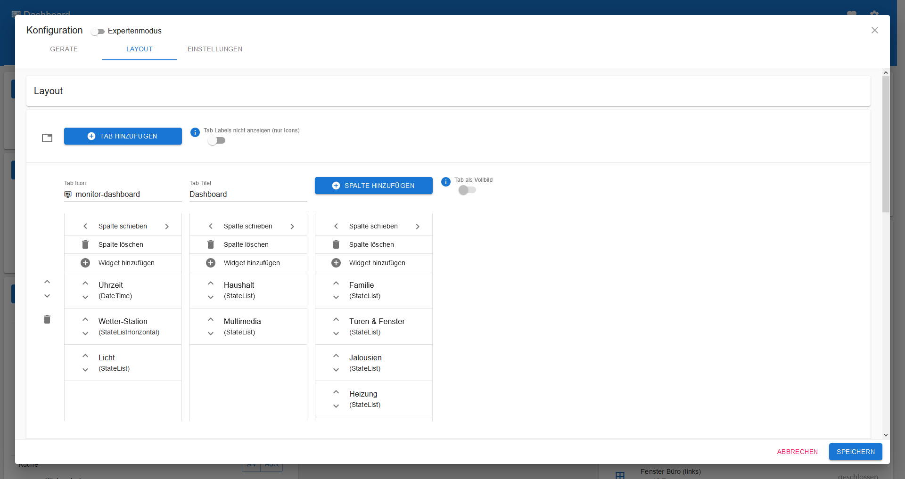
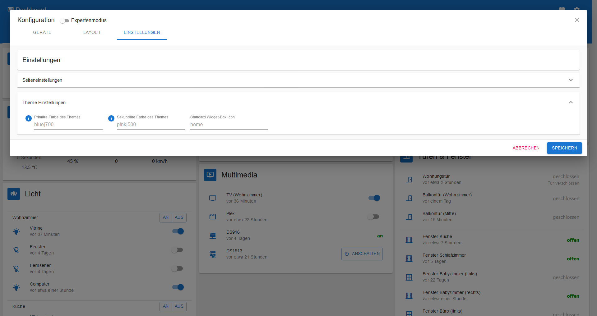

# Introduction

Diese Anleitungen sind für jarvis v2.

## Willkommen bei jarvis

Um jarvis zu öffnen einfach im ioBroker Dashboard die Kachel klicken:

Sofern jarvis nicht öffnet oder andere Probleme auftreten findet sich ggf. [in der Liste häufiger Fehler](sonstiges/faq.md) eine Lösung.

## Konfiguration

Über das Zahnrad-Icon \(über die Topbar rechts oben\) können die Geräte, die Einstellungen und das Layout gepflegt werden:

### Geräte

siehe [Beschreibung für Geräte](geraete/devices/).

### Layout

siehe [Beschreibung für Layout](layout/layout.md).

### Einstellungen

siehe [Beschreibung für Einstellungen](einstellungen/settings.md).

