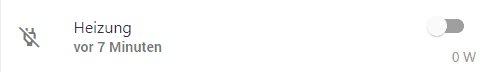

# Beispiele

Pulsierendes Icon



Um ein pulsierendes Icon zu erzeugen muss in den Einstellungen unter Styles zunächst der folgende Code hinzugefügt werden.

```text
.blink {
    animation: blinker 1s linear infinite;
}

@keyframes blinker {
    50% { opacity: 0;
    }
}
```

Danach kann man bei einem Widget unter der Eigenschaft Icon den folgenden JSON Code verwenden.

```text
{
    "<10": "mdi-thermometer blink",
    ">25": "mdi-thermometer blink"
}
```

