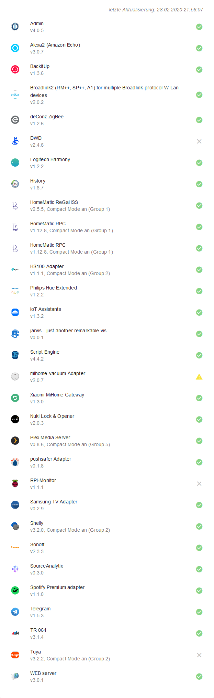
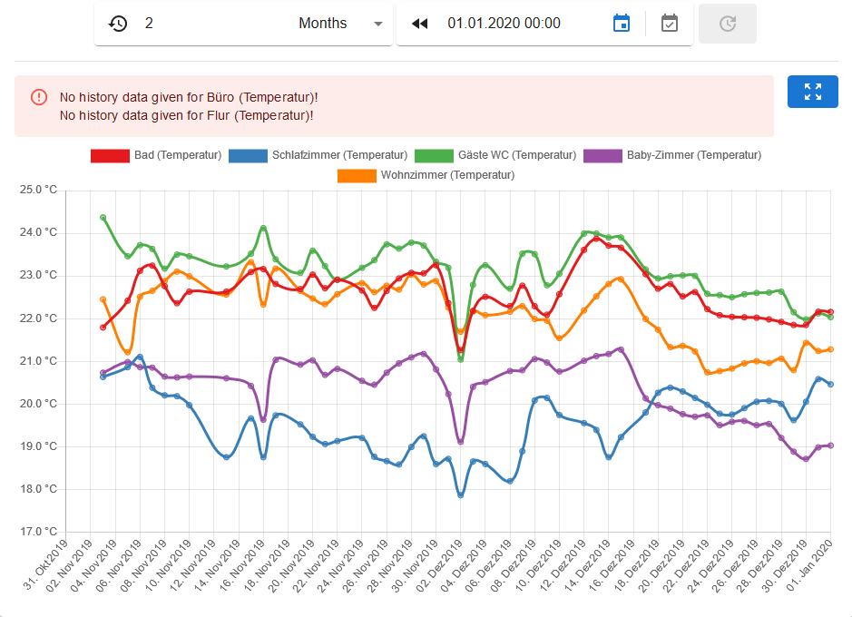
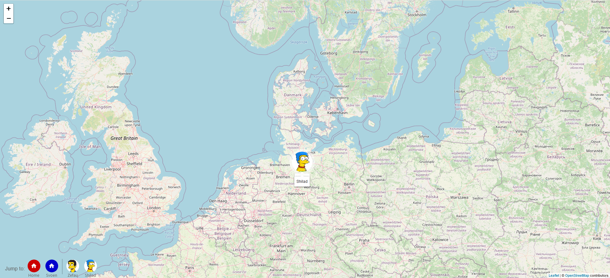
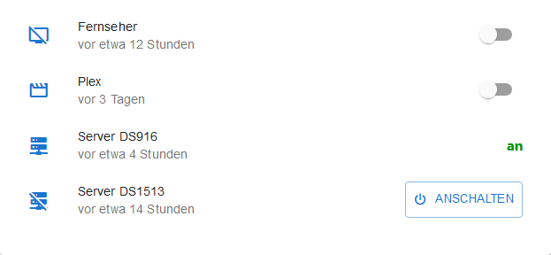
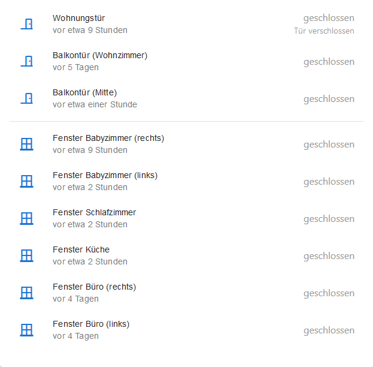
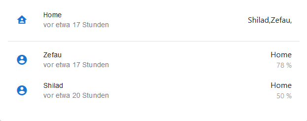
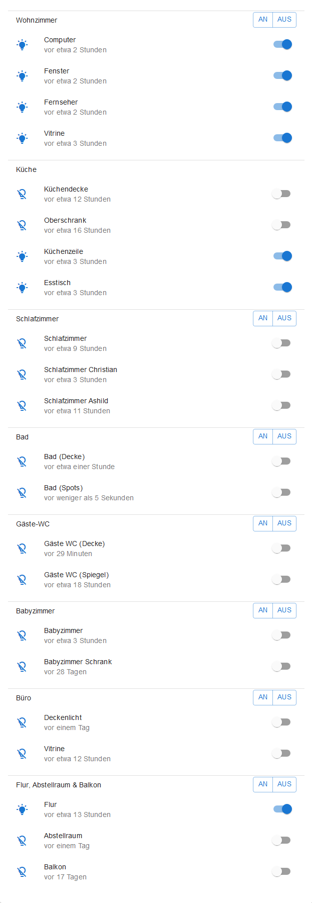
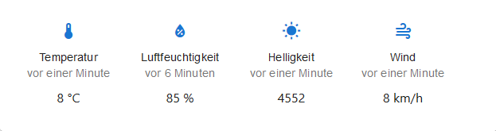

# Module

## Einführung

Module dienen der Visualierung von Datenpunkten und Informationen.

## Globale Einstellungen für Module

Jedes Modul, dass in einem Widget \(einer Box\) angezeigt wird \(und damit nicht fullscreen ist\), unterstützt die folgenden Einstellungen:

| Parameter | Beschreibung | mögliche Werte | Standard |
| :--- | :--- | :--- | :--- |
| `title` | individueller Titel der Box | beliebiger Wert |  |
| `icon` | individuelles Icon der Box | beliebiges Icon von [https://materialdesignicons.com/](https://materialdesignicons.com/) | `home` |
| `iconStyle` | individueller Style des Icons der Box | [_CSS-Anweisungen_](https://www.w3schools.com/cssref/default.asp) _in Javascript Syntax_ | `{ backgroundColor: theme.palette.primary.main, color: '#fff', fontSize: '24px' }` |

## Liste der Module

* [AdapterStatus](modules.md#modul-adapterstatus)
* [Calendar](modules.md#modul-calendar)
* [Chart](modules.md#modul-chart)
* [CustomHTML](modules.md#modul-customhtml)
* [DateTime](modules.md#modul-datetime)
* [DisplayImage](modules.md#modul-displayimage)
* [iFrame](modules.md#modul-iframe)
* [Map](modules.md#modul-map)
* [MediaControl](modules.md#modul-mediacontrol)
* [StateList](modules.md#modul-statelist)
* [StateListHorizontal](modules.md#modul-statelisthorizontal)
* [Weather](modules.md#modul-weather)

### Modul: AdapterStatus

#### Kurzbeschreibung

Zeigt alle installierten Adapter mit ihren Instanzen und dem jeweiligen Status \(active & alive, active & not connected, inactive\) an.

#### Beispiel Screenshots

**Screenshot1**

#### Konfiguration

| Parameter | Beschreibung | Typ | Standard |
| :--- | :--- | :--- | :--- |
| `updates` | Adapter Updates | Switch | `true` |
| `list` | Liste angezeigter Adapter | Text | - |
| `blacklist` | Liste nicht angezeigter Adapter | Text | - |

### Modul: Calendar

#### Kurzbeschreibung

Zeigt ical / ics Inhalte in einem Kalender an.

#### Beispiel Screenshots

Keine Screenshots verfügbar

#### Konfiguration

| Parameter | Beschreibung | Typ | Standard |
| :--- | :--- | :--- | :--- |
| `calendarPreview` | Zeigt eine Kalender-Vorschau | Switch | `true` |
| `calendarView` | Wähle die Art der Anzeige von Ereignissen | RadioGroup | `listView` |
| `refresh` | Aktualisierung \(in Minuten\) | Number | `5` |
| `daysReview` | Zeigt vergangene Ereignisse \(in Tagen\) | Number | - |
| `daysPreview` | Zeigt zukünftige Ereignisse \(in Tagen\) | Number | `7` |

### Modul: Chart

#### Kurzbeschreibung

Stellt historische Werte \(z.B. aus ioBroker.history\) grafisch als Chart mittels Chart.js dar.

#### Beispiel Screenshots

**Screenshot1**

#### Konfiguration

| Parameter | Beschreibung | Typ | Standard |
| :--- | :--- | :--- | :--- |
| `chartConfigyLeftAxisUnitBefore` | Einheit der y-Achse \(vor dem Bezeichner\) | Text | - |
| `chartConfigyLeftAxisUnitAfter` | Einheit der y-Achse \(nach dem Bezeichner\) | Text | - |
| `chartFilterTimeRangeValue` | Standard-Zeit des historischen Rückblicks | Number | `1` |
| `chartFilterTimeRangeUnit` | Standard-Einheit des historischen Rückblicks | Select \(`seconds`, `minutes`, `hours`, `days`, `weeks`, `months`, `years`\) | `days` |
| `liveUpdates` | Live-Aktualisierung | Switch | `true` |
| `multiplicator` | Multiplikator | Number | `1` |

### Modul: CustomHTML

#### Kurzbeschreibung

Zeigt dynamische HTML Inhalte von Datenpunkten an.

#### Beispiel Screenshots

Keine Screenshots verfügbar

#### Konfiguration

Keine Konfiguration

### Modul: DateTime

#### Kurzbeschreibung

Das Modul dient der Anzeige des aktuellen Datums und Zeit.

#### Beispiel Screenshots

**Screenshot1**

#### Konfiguration

| Parameter | Beschreibung | Typ | Standard |
| :--- | :--- | :--- | :--- |
| `format` | Format des Datums / Uhrzeit | Text | `d. MMMM yyyy HH:mm` |
| `style` | Style des Textes | Text | `{ "fontSize": "1.5rem", "textAlign": "center" }` |
| `city` | Zeigt die Stadt | Switch | `true` |
| `sun` | Zeigt Zeiten für Sonnenauf- und -untergang | Switch | `true` |
| `calendarweek` | Zeigt die aktuelle Kalenderwoche | Switch | `true` |

### Modul: DisplayImage

#### Kurzbeschreibung

Zeigt ein Bild aus einer URL oder einem base64-Wert an.

#### Beispiel Screenshots

Keine Screenshots verfügbar

#### Konfiguration

| Parameter | Beschreibung | Typ | Standard |
| :--- | :--- | :--- | :--- |
| _**`url`**_ | Datenpunkt, URL oder Base64-Wert des Bilds | Text | `http://` |
| `height` | Höhe des Fensters | Text | `100%` |
| `width` | Breite des Fensters | Text | `100%` |
| `refresh` | Aktualisierungsintervall | Number | `0` |

### Modul: iFrame

#### Kurzbeschreibung

Zeigt Inhalte anderer Seiten in einem iFrame an.

#### Beispiel Screenshots

Keine Screenshots verfügbar

#### Konfiguration

| Parameter | Beschreibung | Typ | Standard |
| :--- | :--- | :--- | :--- |
| _**`url`**_ | URL, die zu laden / anzuzeigen ist | Text | `http://` |
| `height` | Höhe des iFrame Fensters | Text | `100%` |
| `width` | Breite des iFrame Fensters | Text | `100%` |
| `refresh` | Aktualisierungsintervall | Number | `0` |

### Modul: Map

#### Kurzbeschreibung

Zeigt eine Karte von OpenStreetMap.

#### Beispiel Screenshots

**Screenshot1**

#### Konfiguration

| Parameter | Beschreibung | Typ | Standard |
| :--- | :--- | :--- | :--- |
| `defaultZoom` | initialer Zoom der Karte | Number | `10` |
| `defaultPosition` | initiale Koordinaten auf der Karte | Text | - |
| `tooltipDirection` | Richtung in die der Tooltip öffnet | Select \(`auto`, `center`, `top`, `left`, `right`, `bottom`\) | `bottom` |
| `tooltipPermanent` | Permanenter Tooltip | Switch | `true` |
| `height` | Höhe der Karte | Number | `500` |

### Modul: MediaControl

#### Kurzbeschreibung

Zeigt ein Multimedia-Player an \(z. B. Spotify\).

#### Beispiel Screenshots

Keine Screenshots verfügbar

#### Konfiguration

| Parameter | Beschreibung | Typ | Standard |
| :--- | :--- | :--- | :--- |
| _**`adapter`**_ | Musik Adapter | Select | - |
| `coverMode` | Cover Modus | Switch | - |
| `coverHeight` | Cover Höhe | Number | `200` |
| `coverUrl` | Cover Prefix URL | Text | - |

### Modul: StateList

#### Kurzbeschreibung

Zeigt eine Liste von States an.

#### Beispiel Screenshots

**Screenshot1**

**Screenshot2**

**Screenshot3**

**Screenshot4**

#### Konfiguration

Keine Konfiguration

### Modul: StateListHorizontal

#### Kurzbeschreibung

Zeigt eine Liste von States \(horizontal\) an.

#### Beispiel Screenshots

**Screenshot1**

#### Konfiguration

Keine Konfiguration

### Modul: Weather

#### Kurzbeschreibung

Zeigt die Wetter-Vorschau an.

#### Beispiel Screenshots

Keine Screenshots verfügbar

#### Konfiguration

| Parameter | Beschreibung | Typ | Standard |
| :--- | :--- | :--- | :--- |
| _**`apikey`**_ | API Schlüssel \(affiliate\_id\) von daswetter.com | Text | - |
| _**`localid`**_ | Ort \(localid\) von daswetter.com | Text | - |
| `display` | Anzeigevariante | Select \(`both`, `overview`, `preview`\) | `both` |
| `forecastSunRain` | Zeige Sonne/Regen-Vorschau | Switch | `true` |
| `iconSetWeather` | Icon Set Wetter | Select \(`set1`, `set2`, `set3`, `set4`, `set5`, `set5-white`\) | `set5` |
| `forecastTemperature` | Zeige Temperatur-Vorschau | Switch | `true` |
| `forecastWind` | Zeige Wind-Vorschau | Switch | `true` |
| `iconSetWind` | Icon Set Wind | Select \(`set1`, `set2`, `set5-white`\) | `set2` |

