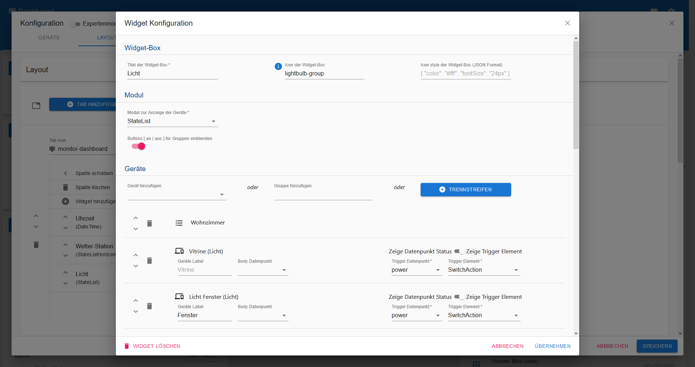

# Widgets

## Widget-Box

Jedes Widget hat ein Label / einen Titel \(Pflichtangabe\). Darüber hinaus kann ein individuelles Icon festgelegt werden und hierfür auch ein individueller Stil \(im JSON Format\).

## Modul

Das Modul dient dem Widget zur Anzeige. [Eine Übersicht und Beschreibung der Module ist im Wiki zu finden](modules.md).

## Geräte

Abhängig vom ausgewähltem Modul können dem Widget [Geräte](../geraete/devices/) \(oder auch Gruppen oder Trennstreifen\) zur Anzeige hinzugefügt werden. Je nach Modul ist für die hinzugefügten Geräte der Datenpunkt auszuwählen, der angezeigt oder angesteuert werden soll. Das Ansteuern bzw. das Auslösen von Datenpunkten erfolgt mittels Komponenten \(z. B. `SwitchInput`\), die per Dropdown ausgewählt werden.

