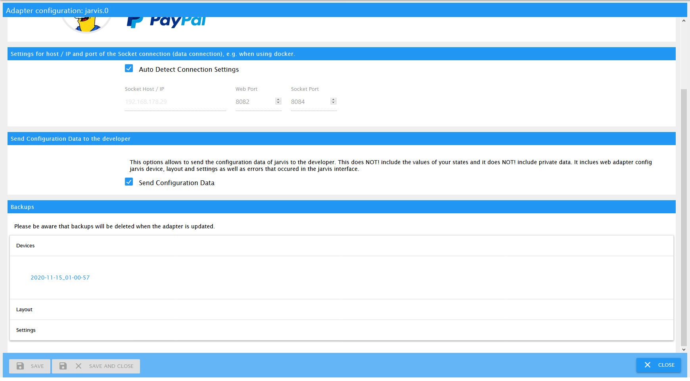
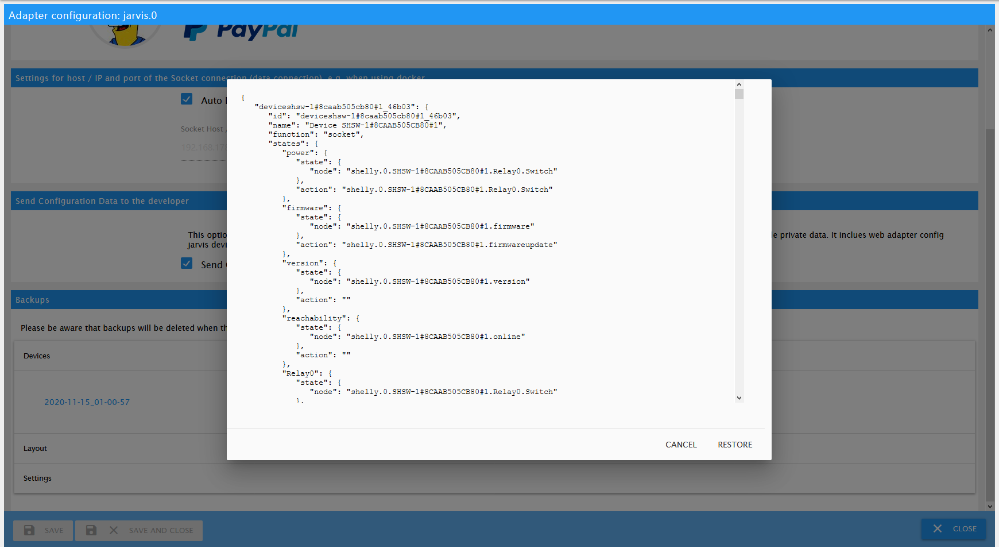

# Backup & Restore

Die Geräte, das Layout und die Einstellungen werden automatisch nach jeder Änderung gesichert und können bei Bedarf direkt über ioBroker wiederhergestellt werden.

**ACHTUNG:** Alte Backups werden bei der Aktualisierung des Adapters auf eine neue Version gelöscht!

## Dashboard

## Auswahl einer Datensicherung zur Wiederherstellung

